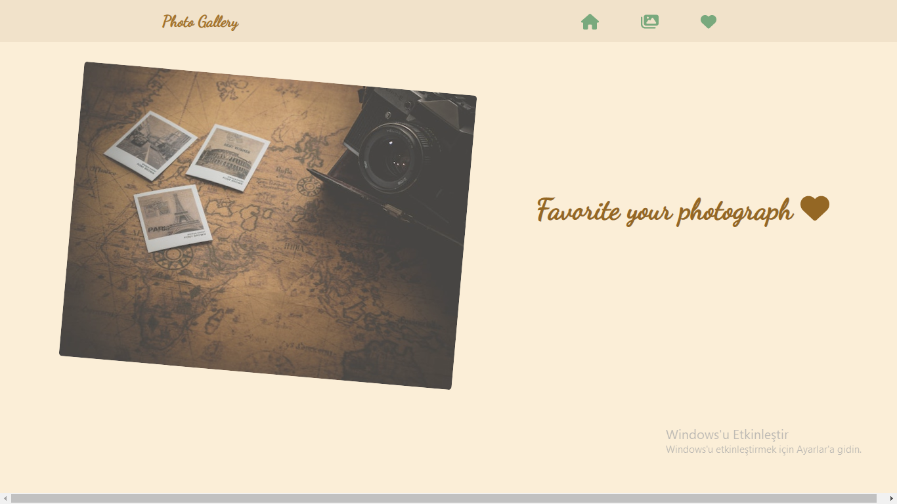
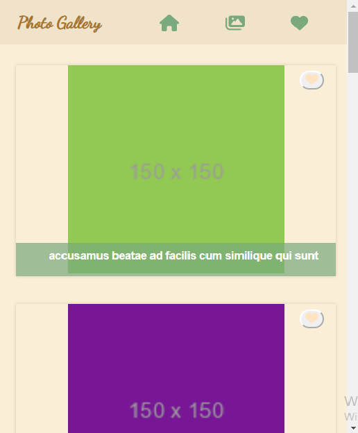

# Photo Gallery

Projeyi oluştururken iki branchta çalıştım.İlk olarak develop branchında geliştirme yaptım ardından main branchında son halini repoya ekledim ve branchları merge ettim. Branchlarda her değişiklik yaptığımda commit mesajı eklemeye özen gösterdim.  

Navigation bar için react-router-dom ile link verdim.Bu sayede home, favorite, albüm sayfalarını görüntüleyebilirsiniz.Albüm sayfasında API'dan fetch ile datayı çektim ve map ile photo card componenti sitilinde görüntüledim.Her bir fotoğraf için favorilere ekleme butonu ekledim.Photo componentinde tıklanan bir state contextApi aracılığı ile diğer bir component olan FavoritesList'e eklemiş ve görüntülenmiş oldum.

## Kütüphaneler  
+ React
+ React-router-dom v6.4

## Sitil
+ SCSS

## Kullanılan API
+ https://jsonplaceholder.typicode.com/photos

## State Yönetimi
+ contextApi

## Demo 
https://photogallery-react.netlify.app/
